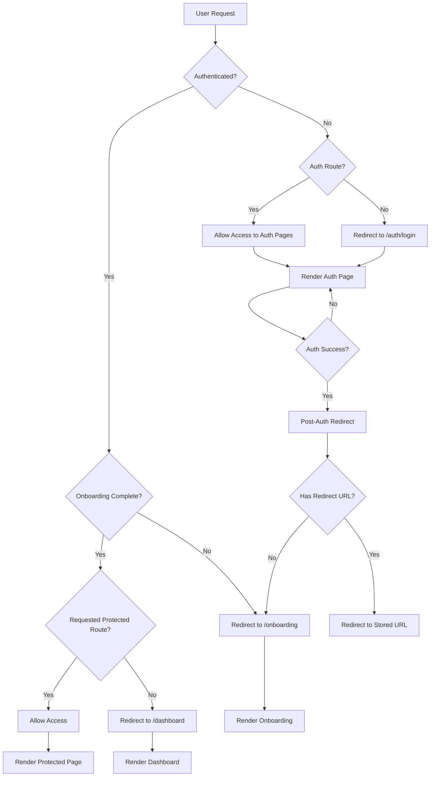
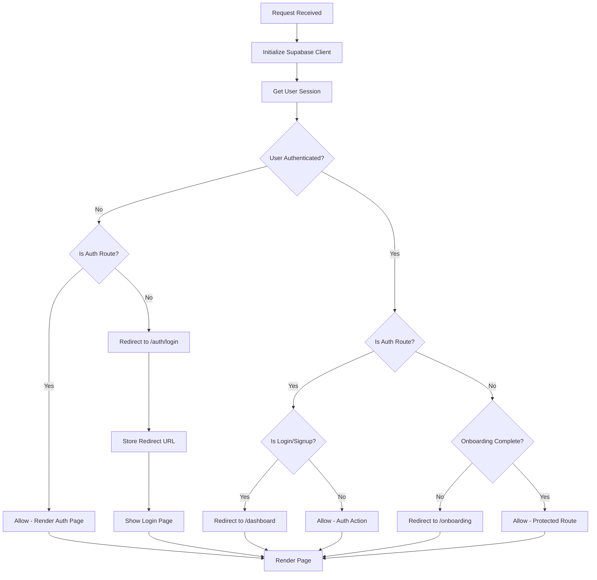

# Authentication System Documentation

## Overview

This document outlines the enhanced authentication system architecture for the Ovet application, built on Supabase Auth with Next.js App Router and server-side rendering support.

## Current Architecture

### Core Components

- **Supabase Auth** - Authentication provider with SSR support
- **Next.js Middleware** - Route protection and session management
- **App Router** - File-based routing with server components
- **Server Actions** - Form handling and auth operations

### Existing Structure

```
/(auth)
├── /login                    # Sign in page
├── /sign-up                  # Registration page
├── /forgot-password          # Password reset request
├── /update-password          # Password update once logged in 
├── /sign-up-success         # Post-registration confirmation
├── /error                   # Auth error handling
└── /confirm                 # Email confirmation handler

/protected                   # Example protected route
```

### Key Files

- `middleware.ts` - Global route protection
- `lib/supabase/middleware.ts` - Supabase session handling
- `lib/supabase/server.ts` - Server-side Supabase client
- `lib/supabase/client.ts` - Client-side Supabase client

## Proposed Enhanced Architecture


## Authentication Flow

### User Journey



### Middleware Logic



## Implementation Plan

### Phase 1: Enhanced Middleware

- [ ] Implement redirect URL storage
- [ ] Add onboarding status detection
- [ ] Enhance route matching logic

### Phase 2: Dashboard Structure

- [ ] Create dashboard layout
- [ ] Implement navigation components
- [ ] Add profile and settings pages

### Phase 3: Onboarding Flow

- [ ] Welcome page implementation
- [ ] Profile setup forms
- [ ] Preferences configuration
- [ ] Progress tracking

### Phase 4: Advanced Features

- [ ] OAuth provider integration
- [ ] Email verification flow
- [ ] Session management improvements
- [ ] Multi-device support

## Security Considerations

### Current Protections

- Server-side session validation
- CSRF protection via Supabase
- Secure cookie handling
- Route-level access control

### Planned Enhancements

- Rate limiting on auth endpoints
- Password strength validation
- Account lockout mechanisms
- Audit logging for auth events

## Configuration

### Environment Variables

```bash
NEXT_PUBLIC_SUPABASE_URL="your-supabase-url"
NEXT_PUBLIC_SUPABASE_ANON_KEY="your-supabase-anon-key"
```

### Middleware Configuration

```typescript
export const config = {
  matcher: [
    "/((?!_next/static|_next/image|favicon.ico|.*\\.(?:svg|png|jpg|jpeg|gif|webp)$).*)",
  ],
};
```

## Testing Strategy

### Current Tests

- Unit tests for Supabase clients
- E2E tests for auth flows
- Component tests for forms

### Planned Tests

- Middleware functionality
- Redirect behavior
- Onboarding flows
- Session management

## Deployment Considerations

### Supabase Configuration

- Auth provider settings
- Email templates
- Redirect URLs
- Security policies

### Next.js Configuration

- Environment variables
- Middleware optimization
- Static/dynamic routes
- Image optimization exclusions
